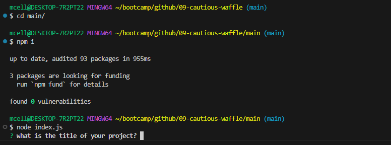

# README generator

  
## Description

This application takes input from the user and inputs it into a professional README format in markdown.

## Contents

- [Installation](#installation)
- [Usage](#usage)
- [Credits](#contributing)
- [License](#license)

## Installation

First, you need to clone the github repository. Second install the the inquirer package by using the command "npm i" in the integrated terminal. Third, you need to run the command "node index.js" within the "main/" directory to initiate the application. The application will then prompt you wil a series of questions to input into the README file.

This image demonstrates the commands necessary to start the application.

## Usage

Once you enter your responses to the questions, you will be generated a professional README document with complete license section, table of contents, and description. If you wish to add images to the README, you will need to add the files manually to the repository you are using the README for.

The application will give you the choice of three different licenses: MIT, ISC, and Unlicense. Whichever license you choose will have a link to the license on opensource.org linked at the top in the license badge and generate a license section at the bottom with the license itself.

## Contributing

This project was generated with the help of the starter code from the github repository [potential-enigma](https://github.com/coding-boot-camp/potential-enigma) from user [gachoi06](https://github.com/gachoi06).

## License

MIT License Copyright (c) <year> <author>

Permission is hereby granted, free of charge, to any person obtaining a copy of this software and associated documentation files (the "Software"), to deal in the Software without restriction, including without limitation the rights to use, copy, modify, merge, publish, distribute, sublicense, and/or sell copies of the Software, and to permit persons to whom the Software is furnished to do so, subject to the following conditions:

The above copyright notice and this permission notice (including the next paragraph) shall be included in all copies or substantial portions of the Software.

THE SOFTWARE IS PROVIDED "AS IS", WITHOUT WARRANTY OF ANY KIND, EXPRESS OR IMPLIED, INCLUDING BUT NOT LIMITED TO THE WARRANTIES OF MERCHANTABILITY, FITNESS FOR A PARTICULAR PURPOSE AND NONINFRINGEMENT. IN NO EVENT SHALL THE AUTHORS OR COPYRIGHT HOLDERS BE LIABLE FOR ANY CLAIM, DAMAGES OR OTHER LIABILITY, WHETHER IN AN ACTION OF CONTRACT, TORT OR OTHERWISE, ARISING FROM, OUT OF OR IN CONNECTION WITH THE SOFTWARE OR THE USE OR OTHER DEALINGS IN THE SOFTWARE.

## Questions

Questions about the prooject should be directed through the following contacts below.
Link to github profile: [mcellis1](https://github.com/mcellis1)
Email: [matthewcellis98@gmail.com](mailto:matthewcellis98@gmail.com)
